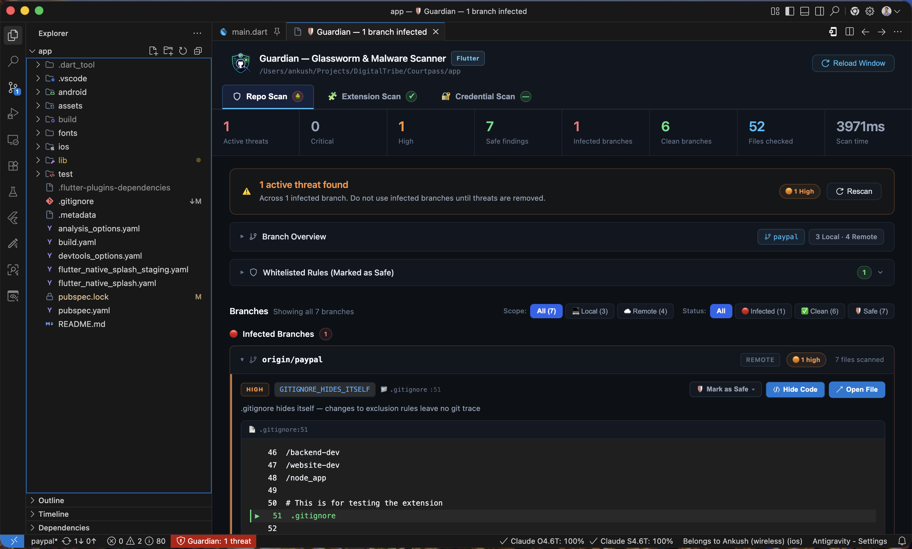
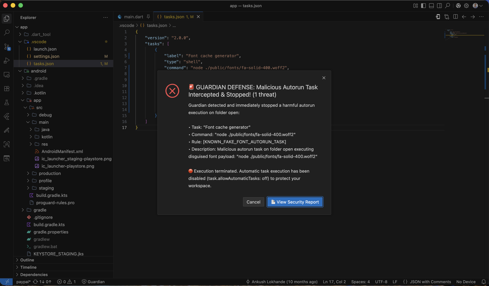
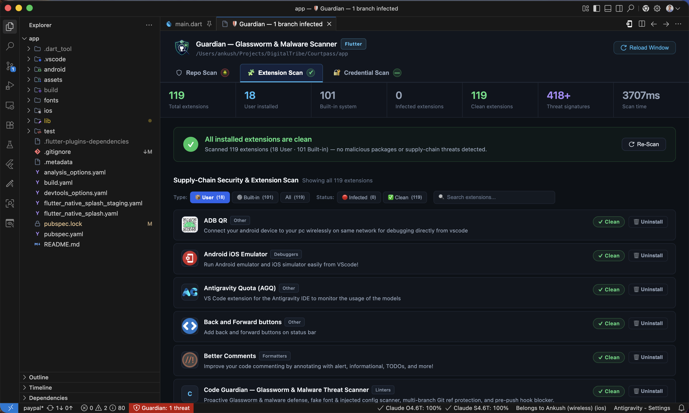
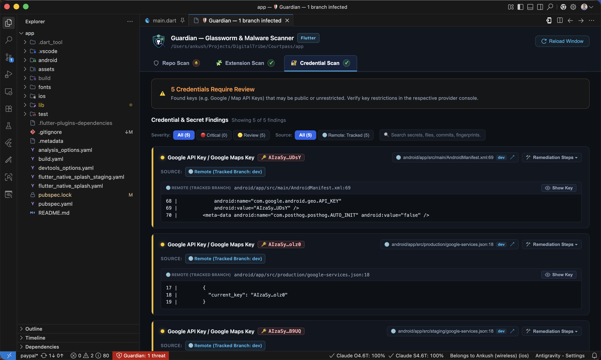

<p align="center">
  
</p>

<h1 align="center">Guardian — Glassworm, Malware, Extension & Credential Scanner</h1>

<p align="center">
  <strong>Proactive DevSecOps Defense, Multi-Branch Git Malware Detection, Extension Threat Auditor & Secret Scanner for VS Code & Open VSX</strong>
</p>

<p align="center">
  <a href="https://marketplace.visualstudio.com/items?itemName=ankushlokhande.guardian-virus-scan"></a>
  <a href="https://open-vsx.org/extension/ankushlokhande/guardian-virus-scan"></a>
  
  
  
</p>

---

## ⚡ What is the Glassworm Threat & Why Do You Need Guardian?

The **Glassworm** malware campaign and modern supply-chain attacks specifically target software developers by planting stealth backdoors directly inside workspace configurations, Git branches, and repository assets. 

When you open an untrusted repository, switch branches, or pull a pull request, attackers exploit automated development workflows before you even execute your project:

* 🪱 **Hidden Autorun Tasks**: Injected `.vscode/tasks.json` directives that execute invisibly on folder open (`runOn: folderOpen`).
* 🪱 **Fake Font Payloads**: Obfuscated JavaScript loaders disguised under innocent font extensions (`fa-solid-400.woff2`, `.ttf`, `.otf`).
* 🪱 **Injected Framework Configs**: Malicious code silently appended to `postcss.config.mjs`, `next.config.js`, `tailwind.config.js`, or `vite.config.ts`.
* 🪱 **Silent Git Propagation Scripts**: Batch and shell helpers (`config.bat`, push scripts) that backdate commit timestamps, amend histories, bypass hooks (`--no-verify`), and force-push malware to your upstream repositories.
* 🪱 **Stealth Workspace Cloaking**: Malicious `.gitignore` configurations designed to hide itself or concealed payload scripts from version control.

**Guardian** completely neutralizes these threats by providing **proactive, multi-layer security** across your entire Git repository, your installed IDE extensions, and your sensitive credentials.

---

## 🖥️ Interactive Security Dashboard (3 Dedicated Tabs)

Guardian brings a unified, state-of-the-art security cockpit right inside your editor with **three dedicated scan tabs**:

---

### Tab 1: 🪱 Repo Scan — Multi-Branch Git & Workspace Defense



* **Multi-Branch & Ref Scanner**: Inspects all local branches, remote-tracking refs, and tags directly via safe Git object database queries (`git show`, `git ls-tree`) with automatic non-blocking remote updates (`git fetch --all --prune`).
* **Active Working Tree & Untracked Coverage**: Detects uncommitted modifications, untracked files, and suspicious ignored files in your active workspace before they get committed or run.
* **Incident-Tested Glassworm Signatures**: Specific pattern matchers for confirmed Glassworm loader variants, fake font payloads, and amend/force-push propagation helpers.
* **Safe Read-Only Sandboxed Viewer**: Click to inspect threats in virtual, read-only documents (`guardian-branch:/...`) so malicious scripts can never accidentally trigger or execute.
* **False-Positive Whitelisting**: Mark benign custom rules as Safe for **This Project** or **All Projects** globally with instant UI reclassification.
* **Adaptive Project Intelligence**: Automatically detects Flutter, Node.js, Next.js, Python, and generic repositories to tailor detection rules.

#### 🚨 Emergency Startup Interceptor & Task Terminator (In Action)



* **Zero-Delay Startup Interception (0ms)**: Guardian activates the exact millisecond a workspace with `.vscode/tasks.json` is opened.
* **Immediate Process Termination**: Automatically kills active task processes (`execution.terminate()`) and disposes background stealth terminals (`terminal.dispose()`).
* **Automatic Re-Execution Lockdown**: Automatically sets `task.allowAutomaticTasks: off` in workspace configuration to block background restarts.
* **Emergency Alert Modal**: Directly displays the intercepted command, rule name, and description with 1-click access to the Security Report.

---

### Tab 2: 📦 Extension Scan — Supply-Chain & IDE Extension Auditor



* **418+ Threat Database Signatures**: Audits all installed extensions across VS Code, Antigravity IDE, Cursor, Windsurf, and VSCodium against known compromised extensions and malicious campaign IDs.
* **Deep Heuristic Analysis**: Inspects extension JavaScript bundles for ForceMemo wave markers (`lzcdrtfxyqiplpd`), invisible Unicode variation selectors (`U+FE00–U+FE0F`, `U+E0100–U+E01EF`), and proximity decoders.
* **Live Radar Scanning Console**: Animated inspection ticker, real-time status counters, and instant threat alerts.
* **1-Click Remediation**: Uninstall detected malicious extensions in bulk with a single click or manage them individually directly from the report view.
* **Type & Status Filters**: Instantly filter by **User-Installed**, **Built-in System**, **Infected**, or **Clean** extensions.

---

### Tab 3: 🔑 Credential Scan — Deep Secret & API Key Detection



* **Multi-Source Secret Detection**: Scans tracked branch tips, deep Git commit history (`--history`), local uncommitted files (`.env`, `.npmrc`, `.pem`), and `.git/config` remote URLs for leaked API keys, tokens, and private credentials.
* **Single-Item Card Consolidation**: Automatically aggregates identical secrets discovered across multiple branches, commits, and files into a single unified finding card.
* **1-Click Plaintext Clipboard Copy**: Click the token chip to copy the full unmasked key to the clipboard with instant `"✓ Copied!"` feedback while keeping on-screen text safely masked.
* **In-Place Eye Toggle**: Reveal or hide unmasked secret values within syntax-highlighted code previews on demand.
* **Remediation & History Purging**: Built-in remediation steps including provider revocation links and `git filter-repo` commands to permanently eradicate leaked secrets from Git history.
* **100% Offline & Private**: Executes entirely locally on your machine. Secrets, code, and branch names never leave your computer.

---

## 🛑 Complete Threat Detection Matrix

Guardian inspects your workspace against an extensive catalog of threat rules:

| Threat Rule | Severity | Category | Target File / Area | Threat Description |
| :--- | :--- | :--- | :--- | :--- |
| `KNOWN_FAKE_FONT_AUTORUN_TASK` | 🔴 Critical | **Glassworm** | `.vscode/tasks.json` | Confirmed hidden folder-open task executing `fa-solid-400.woff2` payload via Node. |
| `KNOWN_INJECTED_CONFIG_V1` | 🔴 Critical | **Glassworm** | PostCSS / Next / Tailwind config | Confirmed obfuscated loader appended after export (`global['!']` + `rmcej%otb%`). |
| `KNOWN_INJECTED_CONFIG_V2` | 🔴 Critical | **Glassworm** | PostCSS / Next / Tailwind config | Confirmed padded require/network/process-spawn loader appended to configuration. |
| `KNOWN_FAKE_FONT_PAYLOAD` | 🔴 Critical | **Glassworm** | `.woff2`, `.ttf`, `.otf`, `.woff` | Confirmed JavaScript loader hidden inside a file with a font extension. |
| `FORCE_PUSH_PROPAGATION_SCRIPT` | 🔴 Critical | **Glassworm** | `config.bat` / scripts | Backdates system time, amends commit, bypasses hooks, and force-pushes origin. |
| `AUTO_RUN_ON_OPEN` | 🔴 Critical | Workspace Security | `.vscode/tasks.json` | Flag automation tasks configured to run automatically upon folder open. |
| `STEALTH_TERMINAL` | 🔴 Critical | Workspace Security | `.vscode/tasks.json` | Detects hidden, background, or headless terminals designed for stealth execution. |
| `NODE_EXECUTES_BINARY` | 🔴 Critical | Workspace Security | `.vscode/tasks.json` | Identifies tasks attempting to execute binary files disguised as font or script files via Node. |
| `AUTO_TASKS_ENABLED` | 🔴 Critical | VS Code Settings | `.vscode/settings.json` | Flags configurations that automatically permit task execution without confirmation. |
| `OBFUSCATED_COMMAND` | 🟠 High | Malware Detection | `.vscode/tasks.json` | Detects base64 or obfuscated command payloads in tasks. |
| `NETWORK_DOWNLOAD_IN_TASK` | 🟠 High | Supply Chain | `.vscode/tasks.json` | Identifies curl, wget, or fetch commands downloading unverified remote scripts. |
| `INVALID_FONT_MAGIC` | 🟠 High | Asset Integrity | Font assets (`.woff2`, `.ttf`) | Flags corrupt or disguised font files with invalid magic header bytes. |
| `GITIGNORE_HIDES_ITSELF` | 🟠 High | Stealth Bypass | `.gitignore` | Warns if `.gitignore` attempts to hide itself or push scripts from tracking. |
| `GITIGNORE_HIDES_PUSH_SCRIPT` | 🟠 High | Stealth Bypass | `.gitignore` | Detects gitignore rules hiding `.sh` or `.bat` executable scripts. |
| `PUBSPEC_DEP_OVERRIDE` | 🟠 High | Flutter / Dart | `pubspec.yaml` | Flags dependency override manipulation pointing to untrusted sources. |
| `PUBSPEC_UNKNOWN_GIT_DEP` | 🟠 High | Flutter / Dart | `pubspec.yaml` | Warns against untrusted Git repository dependency configurations. |
| `GITIGNORE_HIDES_VSCODE` | 🟡 Medium | Stealth Bypass | `.gitignore` | Detects hiding `.vscode/` configurations from normal commit review. |
| `SENSITIVE_ENV_IN_LAUNCH` | 🟡 Medium | Credential Leak | `.vscode/launch.json` | Flags hardcoded secrets or environment variables in launch configs. |
| `BUILD_YAML_CUSTOM_BUILDER` | 🟡 Medium | Flutter / Dart | `build.yaml` | Flags custom builder steps executing unverified compilation tasks. |
| `TERMINAL_ENV_ISOLATION` | 🟡 Medium | VS Code Settings | `.vscode/settings.json` | Flags modifications that alter the terminal environment variables. |

---

## 🚀 Quick Start & Usage

1. **Automatic Silent Scan**: Guardian automatically runs a non-intrusive background scan whenever a workspace is opened.
2. **Status Bar Indicator**: Look at the bottom status bar for the `🛡️ Guardian` badge. Click it anytime to open the full interactive report.
3. **Command Palette**: Press `Cmd+Shift+P` (macOS) or `Ctrl+Shift+P` (Windows/Linux) and run:
   * `Guardian: Scan for Glassworm & Workspace Threats`
   * `Guardian: Open Glassworm & Security Report`
   * `Guardian: Scan Installed Extensions for Malware`
   * `Guardian: Scan for Exposed Credentials & Secrets`
4. **Instant Remediation**:
   * **Mark as Safe**: Whitelist internal project rules with 1 click.
   * **Inspect Safely**: Click any threat line to view quarantined code in a read-only tab.
   * **Purge Leaks**: Follow built-in `git filter-repo` guides to purge exposed secrets.
   * **Clean Extensions**: Uninstall suspicious or compromised extensions directly from the UI.

---

## 💡 How Guardian Works Under the Hood

Guardian uses a **Zero-Checkout Architecture** to safeguard your system:

```bash
# Safe, non-invasive Git object inspection:
git show <branch>:.vscode/tasks.json
git ls-tree -r --name-only <branch>
```

* **No Branch Switching**: Your current Git working tree, stashes, and branch remain completely undisturbed.
* **Sandboxed Document Provider**: Files opened from infected branches are served via a custom virtual document scheme (`guardian-branch:/...`) that renders the code in a read-only buffer without triggering IDE task hooks or filesystem watchers.

---

## ⚙️ Configuration Options

Customize Guardian via VS Code Settings (`settings.json`):

```json
{
  // Automatically fetch remote branch metadata before scanning
  "guardian.fetchRemotesBeforeScan": true
}
```

---

## 📦 Installation

### From VS Code Marketplace
1. Open VS Code and press `Ctrl+Shift+X` / `Cmd+Shift+X`.
2. Search for **`Guardian`** or **`guardian-virus-scan`**.
3. Click **Install**.

### From Open VSX Registry
Install directly in Open VSX-compatible editors (e.g., VSCodium, Eclipse Theia, Cursor, Windsurf, Antigravity IDE):
```bash
npx ovsx get ankushlokhande.guardian-virus-scan
```

### Manual VSIX Installation
1. Download the latest `.vsix` release from [GitHub Releases](https://github.com/ankush-ppie/guardian-virus-scan/releases).
2. Run in terminal or VS Code Command Palette:
   ```bash
   code --install-extension guardian-virus-scan-1.5.1.vsix
   ```

---

## 🔍 Search & Index Keywords

`guardian` • `guardian-virus-scan` • `gaurd-virus` • `gaurd` • `code-guardian` • `codeguardian` • `glassworm` • `glass-worm` • `glassworm-scanner` • `malware-scanner` • `virus-scan` • `pre-push` • `pre-push-hook` • `git-push` • `forbidden-patterns` • `force-push-protection` • `commit-amend` • `extension-auditor` • `extension-scan` • `credential-scan` • `secrets-scanner` • `supply-chain-security` • `devsecops` • `tasks-json` • `fake-font` • `stealth-terminal` • `injected-config` • `vscode-security` • `git-security`

---

## 📋 Changelog

See [CHANGELOG.md](CHANGELOG.md) for full release notes and feature history.

---

## ⚖️ License

Distributed under the [MIT License](LICENSE). Copyright © 2026.
